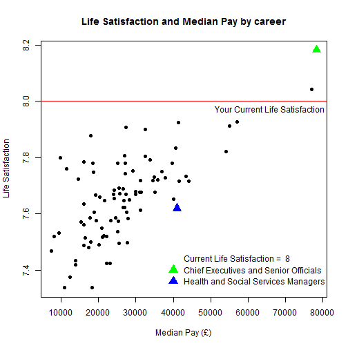

Happy Jobs
========================================================
author: Ewen McKinnon
date: June 10 2016
transition: rotate

<small> 
Project Presentation  
Developing Data Products Course    
Coursera Data Science Specialization  
</small>

Introduction
========================================================

There has been increased interest in well-being in recent years. 
Many National Statistics institutions around the world are now measuring
the well-being of their nation's populations.

In the UK four new **personal well-being** questions have been added to the
Annual Population Survey since 2011. The large sample size enables differences
in well-being to be estimated for people working in different types of job.

The What Works Centre for Well-being in the UK has published data on well-being
by occupation. We have written a small 'shiny' application so that you can explore the data.  

Application Background
========================================================

The application uses data which is available at this link from the [UK What Works Centre for Well-being] (https://whatworkswellbeing.org/wellbeing-2/wellbeing-data/personal-wellbeing-for-major-and-sub-major-standard-occupation-codes/)  

Users answer two survey questions on their life satisfaction and the extent to which activities in life are 'Worthwhile'. These are answered on a scale from 0 to 10. Further info on these questions can be found from the [Office for National Statistics] (http://www.ons.gov.uk/ons/guide-method/harmonisation/secondary-set-of-harmonised-concepts-and-questions/interim-standard---personal-well-being.pdf).

Users also enter two types of occupation from the international standard list of occupations. The first occupation is the user's current chosen job and the second is an occupation they would like to compare with.

Example Application Output
========================================================
The application retreives data from the published well-being dataset based on user inputs.

Where to find the App
========================================================

The App is available at:

- https://ermckinnon.shinyapps.io/WellbeingProject/

The code for the app is available at:

- https://github.com/ermckinnon/welbeingapp

The code for this presentation is available at:

- https://github.com/ermckinnon/welbeingapp
